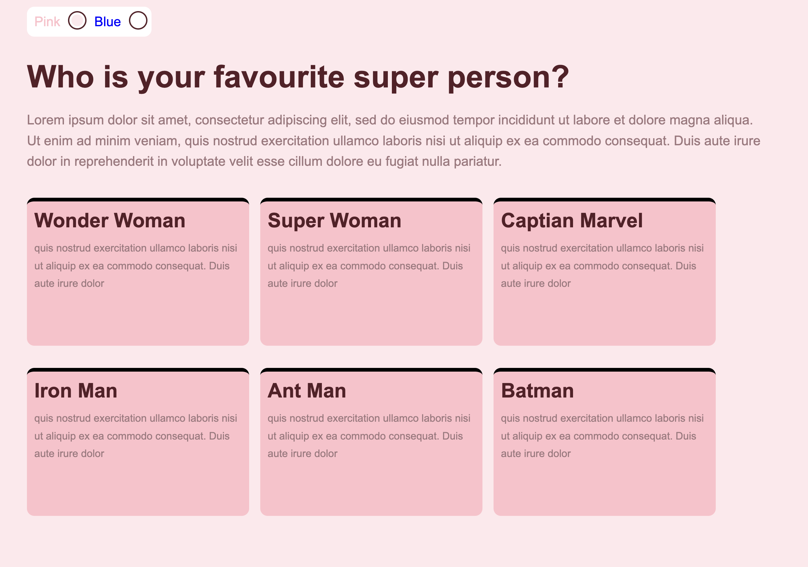

# CSS Theme Switcher

CSS theme switcher is made 100% in CSS3 and HTML5. It is an accessible solution too.

## What we are using

- css variables

- pseudo classes

- semantic tags (radio)

### Like it? Have feedback?

reach out [Twitter]twitter.com/hellonehha)